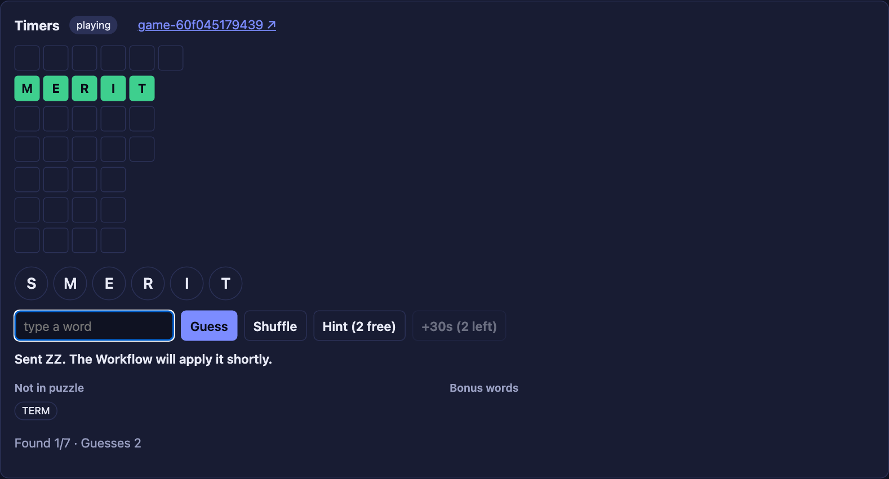
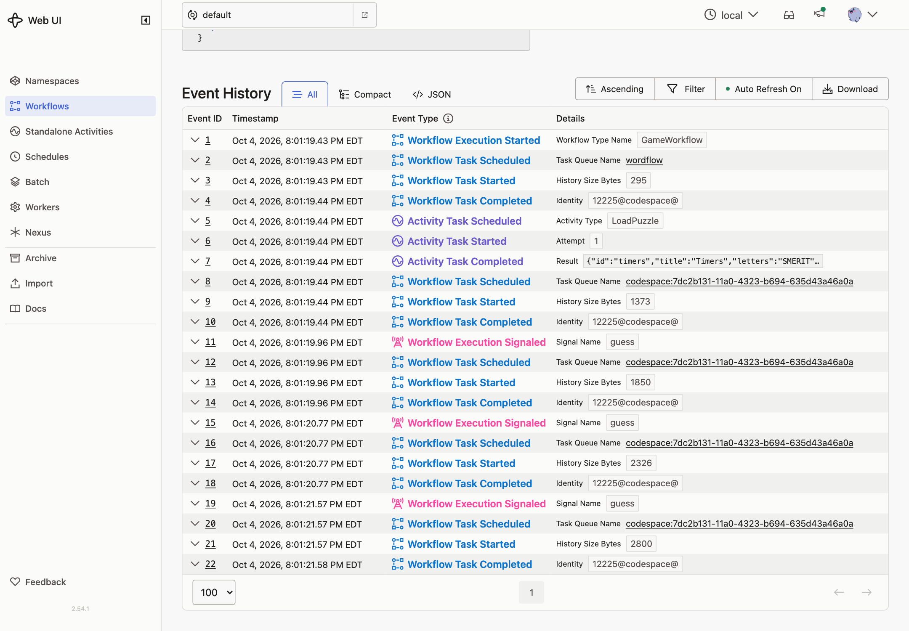

# 03 · Signals and Queries

**Goal:** the game stays open while you play. You send guesses to it and read the board from it.

## Concepts

**Long-running Workflows.** A Workflow can wait for minutes, days, or years. While it waits, it uses no Worker resources. Its state lives in its Event History, and a Worker rebuilds it when there's something to do.

**Signal.** A one-way message to a running Workflow. It is recorded in the history (`WorkflowExecutionSignaled`), so it's never lost, even if no Worker is running. The sender only learns that Temporal accepted the message. It gets no reply and can't tell whether the Workflow acted on it.

**Query.** A read-only request. A Worker runs the Query handler against the Workflow's current state and returns the answer. Queries aren't recorded in history, and their handlers must not change state or block.

**Message handlers.** Register Query handlers before the Workflow's first blocking call, so the Workflow can answer from the moment it starts. Until the puzzle has loaded, our Query returns a `loading` view.

## What you'll build

- `GameWorkflow` registers a `state` Query, loads the puzzle, then loops: receive a `guess` Signal, apply it, until every word is found. It returns the game's result.
- `StartGame` starts the Workflow and returns the game ID without waiting.
- `GetGame` sends the `state` Query.
- `SubmitGuess` sends the `guess` Signal and returns nothing. The API answers `202 Accepted`, and the web app fetches the board again.

There's no timer yet, so a game only ends when you find every word.

## Build it

Follow [`build.md`](build.md).

## Check it

Before you start, run `make clean-workflows` to end games from earlier lessons.

- [ ] Click a puzzle. The board appears, sometimes after a brief **loading** state.
- [ ] Guess a word in the puzzle. Its slot fills in.
- [ ] Guess a word made from the letters that isn't in the puzzle. It appears under **Not in puzzle**.

  

- [ ] Guess `zz`. The app says **Sent ZZ**, then nothing changes. The game ignored it, and nobody told you. That's the downside of Signals.
- [ ] In the Temporal UI, every guess is a `WorkflowExecutionSignaled` event. The board refreshes don't appear anywhere: Queries aren't recorded.

  

- [ ] Stop the Worker and send two guesses. They're still accepted, but the board stops refreshing because nothing can answer the Query. Start the Worker. Both guesses are applied.
- [ ] Find every word. The status changes to **won**, and the Workflow completes with the result (`won`, `score`).

Next, Updates fix the missing feedback: you'll know right away whether a guess counted.
