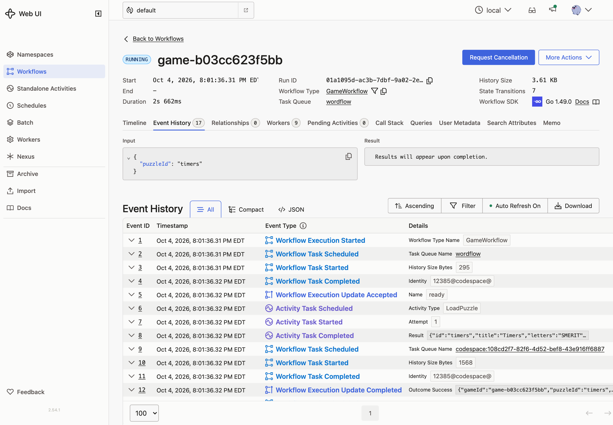
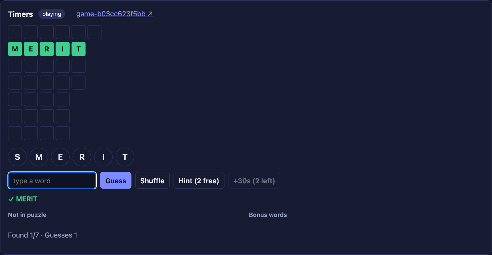
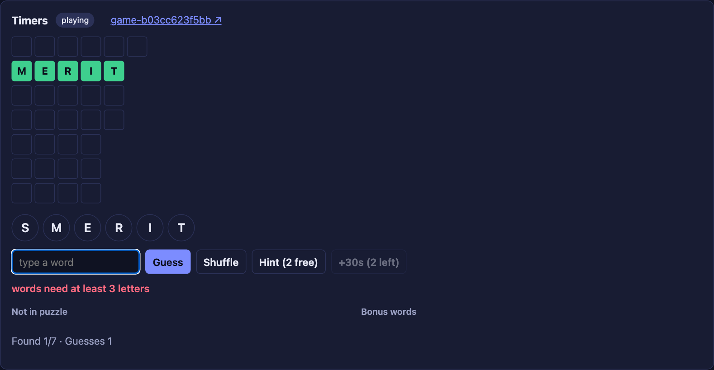

# 04 · Updates

**Goal:** every guess gets an immediate answer, and a new game returns its board as soon as it's ready.

## Concepts

**Update.** A request to a running Workflow that can change its state and returns a result, or an error, to the caller. It's a Signal and a Query in one round trip.

**Validator.** An optional function that runs before an Update is accepted. If it returns an error, the caller gets that error and nothing is written to history. Validators must not change state or block. Once accepted, an Update is recorded (`WorkflowExecutionUpdateAccepted`), and so is its result (`WorkflowExecutionUpdateCompleted`).

**Update ID.** Temporal de-duplicates Updates by ID within a Workflow run. Send the same Update ID twice and the second call returns the first result. We use the request's `Idempotency-Key`, so retrying a guess can't count it twice.

**Update-with-Start.** Starts a Workflow and sends it an Update in one call. With the ID conflict policy *use existing*, a retried request finds the Workflow it already started and sends the Update to it.

**Waiting in a handler.** Handlers may block, for example to wait for a condition. Our `ready` Update waits until the puzzle has loaded, then returns the board. The caller gets its answer early while the Workflow keeps running.

**Finishing cleanly.** When a guess wins the game, the main loop could complete the Workflow before that guess's Update has replied. Wait for all handlers to finish before returning.

## Patterns

- [Request-Response via Updates](https://docs.temporal.io/design-patterns/request-response-via-updates)
- [Early Return](https://docs.temporal.io/design-patterns/early-return)

## What you'll build

- A `ready` Update that waits for the puzzle and returns the board.
- The `guess` Signal becomes a `guess` Update with a validator that rejects invalid words. The handler returns the outcome.
- The main loop becomes "wait until the game is over, then wait for handlers to finish".
- `StartGame` uses Update-with-Start (`ready`). `SubmitGuess` sends the `guess` Update with the request ID as its Update ID.

## Build it

Follow [`build.md`](build.md).

## Check it

Run `make clean-workflows`, then restart the Worker and the server.

- [ ] Click a puzzle. The board appears right away, with no loading state.
- [ ] In the Temporal UI, the history starts with `WorkflowExecutionStarted`, then the `ready` Update's accepted and completed events, with the `LoadPuzzle` Activity between them.

  

- [ ] Guess a word. The app tells you what happened: found, not in puzzle, or already found.

  

- [ ] Guess `zz`. You see **words need at least 3 letters** right away, and no new events appear in the history.

  

- [ ] Send the same guess twice with the same key. Copy the game ID from the Temporal UI:

  ```sh
  curl -s -XPOST localhost:8080/api/games/GAME_ID/guesses \
    -H 'Idempotency-Key: try-1' -d '{"word":"WORD"}'
  ```

  Run it twice. Both replies are identical, the `guesses` count went up only once, and the history has only one Update for it.
- [ ] Find the last word. The final guess returns `found` with status **won**, and then the Workflow completes.
