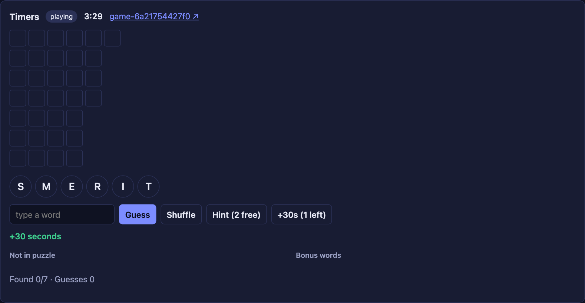
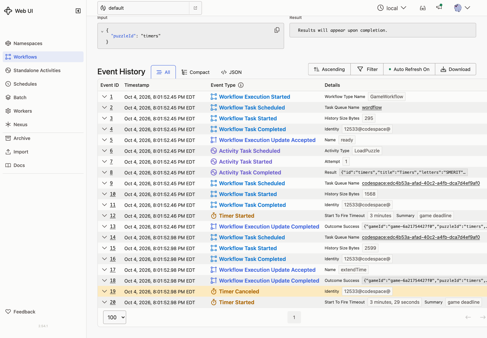
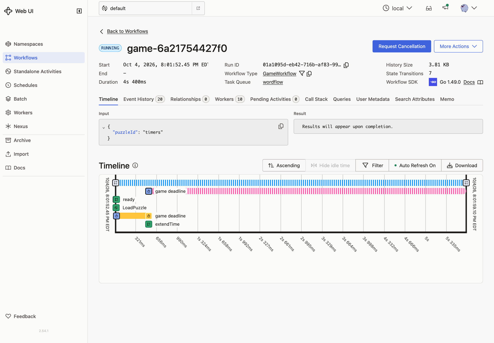

# 05 · Durable Timers

**Goal:** each game has a clock. When it runs out, the game ends. Players can add 30 seconds, twice.

## Concepts

**Durable Timer.** A Workflow can sleep or start a Timer for any length of time. The Temporal Service keeps the Timer, not the Worker, so it fires on time even if no Worker is running. It's recorded as `TimerStarted`, then `TimerFired` or `TimerCanceled`.

**Waiting for "whichever comes first".** Workflows often wait for a Timer *or* a change in state. Here the clock waits for the deadline, the game ending, or the deadline moving.

**Cancelling a Timer.** A Timer you no longer need should be cancelled. Otherwise it still fires later and wakes the Workflow for nothing.

**Workflow time.** The SDK's clock returns the time of the current Workflow Task. It doesn't move while your code runs, and it's the same when the code is re-run.

## Patterns

- [Updatable Timer](https://docs.temporal.io/design-patterns/updatable-timer): when the deadline changes, cancel the Timer and start a new one.

## What you'll build

- After loading the puzzle, set the deadline to *now + the puzzle's time limit*.
- A `runClock` loop: start a Timer for the time remaining, then wait until it fires, the game ends, or the deadline changes. Cancel the Timer, and if it fired, expire the game.
- An `extendTime` Update, with a validator, that moves the deadline 30 seconds later.
- `ExtendTime` in the API sends that Update.

## Build it

Follow [`build.md`](build.md).

## Check it

Run `make clean-workflows`, then restart the Worker and the server.

- [ ] The game shows a countdown. The history has a `TimerStarted` event labelled **game deadline**.
- [ ] Click **+30s**. The countdown jumps forward 30 seconds. The history shows `TimerCanceled`, then a new `TimerStarted`.

  

  

  The **Timeline** tab shows the same thing: the first **game deadline** Timer is cancelled by the `extendTime` Update, and a new one starts.

  

- [ ] Click **+30s** a third time. You get **no time extensions left**, and nothing is added to the history.
- [ ] Let the clock run out. The status becomes **timed_out**, `TimerFired` appears, and the Workflow completes.
- [ ] Start a game, then stop the Worker. Wait until the deadline has passed, then start the Worker. The game is timed out right away, and `TimerFired` shows the deadline time, not the time the Worker came back.
