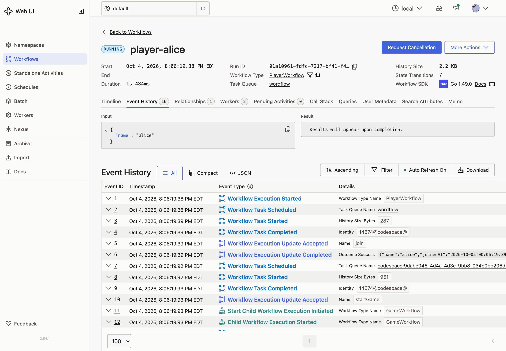
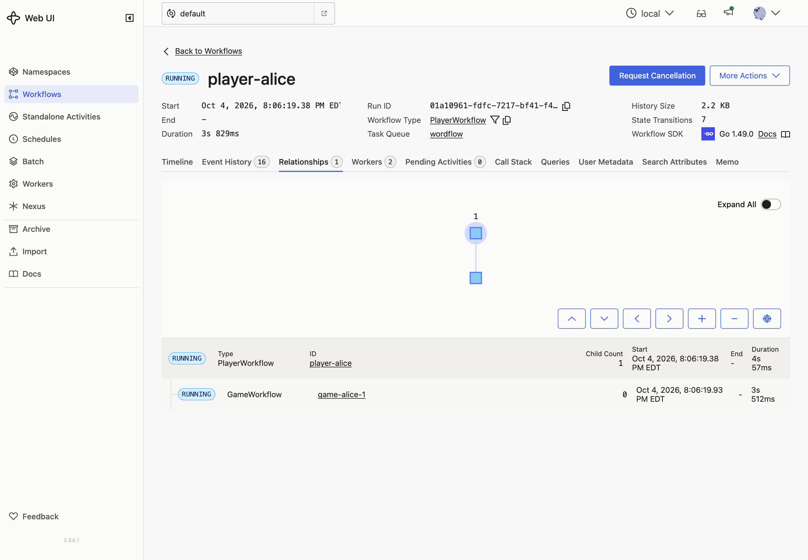
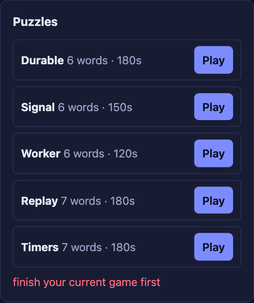
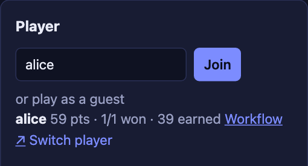

# 07 · Child Workflows

**Goal:** a player's games belong to them. Finishing a game adds its score to the player's points and stats.

## Concepts

**Child Workflow.** A Workflow started by another Workflow. It has its own ID, Event History, and result. The parent can wait for it to start, wait for it to finish, or both. Children keep each history small and focused. The player's history records "game 3 started" and "game 3 finished with this result", not every guess.

**Parent close policy.** What happens to a running child when its parent closes. The default *terminate* ends the child too. Other options are *abandon* (the child keeps running) and *request cancel*.

**Handlers run concurrently.** When a handler blocks, other handlers and the main loop can run. Change state *before* blocking, so the next message sees it. `startGame` marks the player as busy before it waits for the child to start. Without that, a second `startGame` could pass the validator while the first one waits.

**Deterministic IDs.** The game ID comes from the player's state (`game-alice-3`), so it's the same every time the code re-runs.

## Patterns

- [Child Workflows](https://docs.temporal.io/design-patterns/child-workflows)

## What you'll build

- `GameWorkflow` takes an optional player ID.
- A `startGame` Update on `PlayerWorkflow`. The validator allows one game at a time. The handler marks the player as busy, starts a child `GameWorkflow`, waits for it to *start*, and returns the game ID.
- The Player main loop waits for an active game, waits for its result, and records it.
- `StartGame` in the API: for a player, send `startGame` to the player, then `ready` to the new game. Guests use the Lesson 4 path.

## Build it

Follow [`build.md`](build.md).

## Check it

Run `make clean-workflows`, then restart the Worker and the server. Join again, because the old player Workflows are gone.

- [ ] Join as `alice` and start a game. In the Temporal UI, `player-alice` shows `StartChildWorkflowExecutionInitiated` and `ChildWorkflowExecutionStarted`. The game's ID is `game-alice-1`, and its page links to its parent.

  

  The **Relationships** tab shows the parent and its child.

  

- [ ] Click another puzzle while playing. You get **finish your current game first**, and nothing is added to her history.

  

- [ ] Finish the game, or let it time out. The player panel updates: games played, and points increased by the score. `player-alice` shows `ChildWorkflowExecutionCompleted` with the result.

  

- [ ] Start another game, then terminate `player-alice` from the Temporal UI. Her game is terminated too: that's the parent close policy.
- [ ] Click **Switch player** and start a game without joining. Guest games still work.
