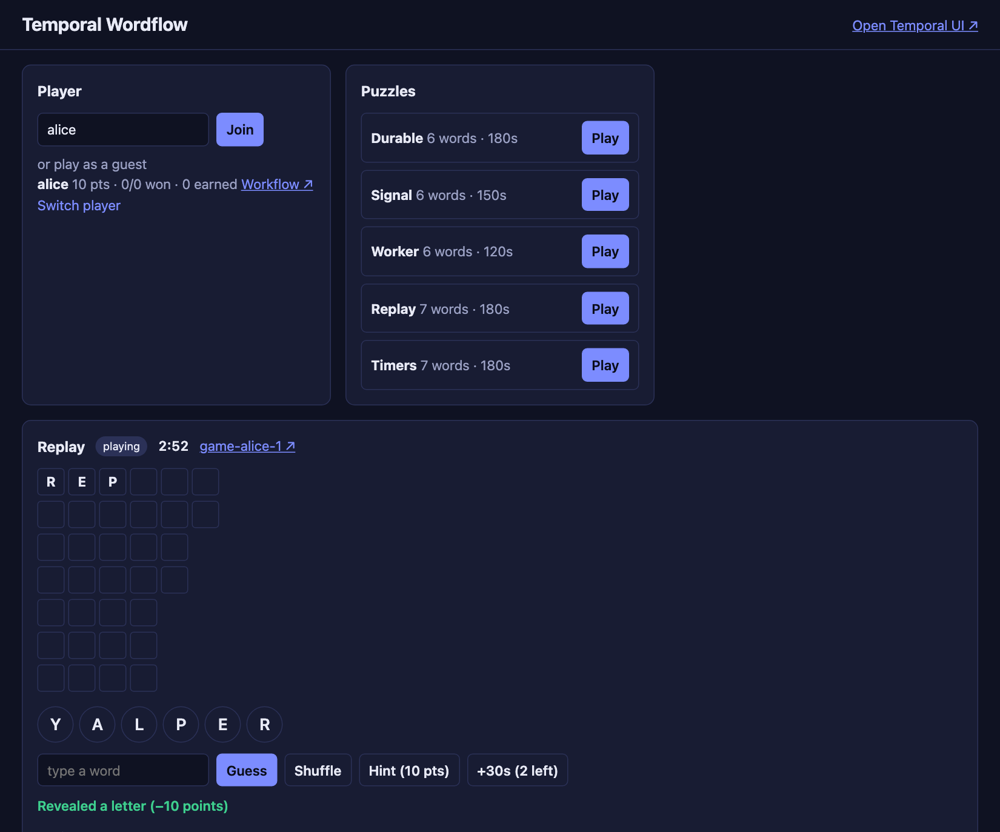
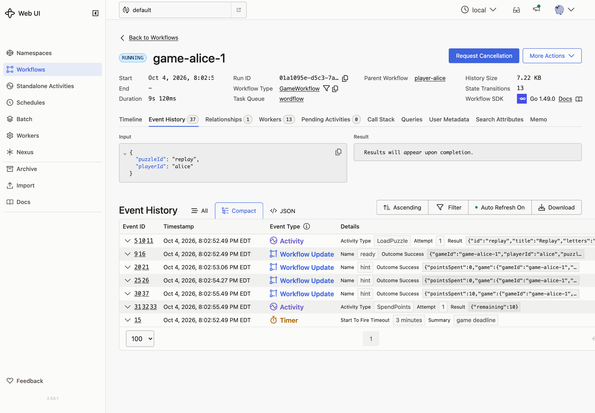
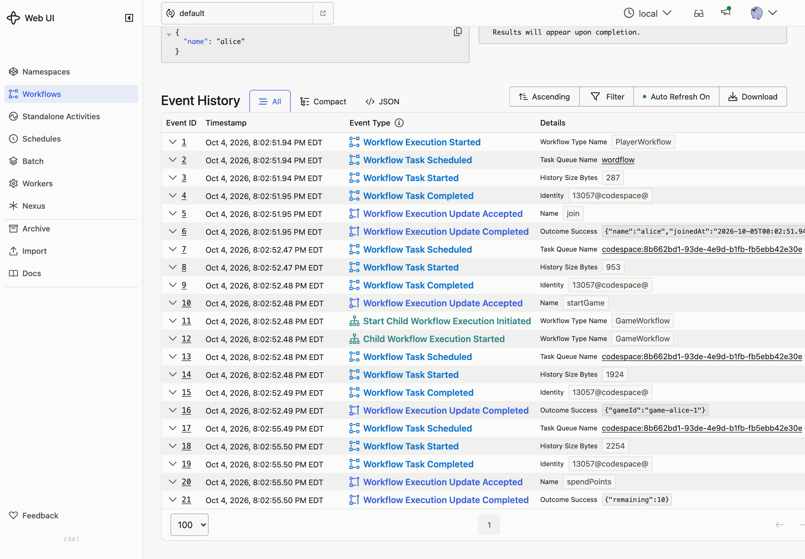

# 08 · Workflow to Workflow

**Goal:** hints. The first two are free. After that, each costs a player 10 points, paid by the Player Workflow.

## Concepts

**Workflows can't call the Client.** A Client call is a network call, so it isn't deterministic. To send a message to another Workflow, a Workflow runs an Activity, and the Activity uses a Client. The Worker gives the Activity its Client when it starts. That's dependency injection, the same as the puzzle store in Lesson 2.

**Errors that mean "no".** When the Player rejects a payment (not enough points), the Activity gets an application error. Retrying won't change the answer, so the Activity makes it non-retryable.

**Idempotency across Workflows.** An Activity can run more than once. For example, a Worker crash after the Update succeeded but before the result was recorded causes a retry. If each attempt sent a new Update, the player could pay twice. Instead, the Update ID is derived from the hint request's own Update ID. Every retry of the same hint sends the same Update ID, and the Player de-duplicates it.

**Handlers interleave.** While the `hint` handler waits for its Activity, other handlers run. A guess could finish the game in the middle of a hint. A Workflow **mutex** makes the handlers that touch the game take turns. After getting the lock, re-check the rules: the validator ran before the wait.

## Patterns

- [Activity Dependency Injection](https://docs.temporal.io/design-patterns/activity-dependency-injection)
- [Non-Retryable Errors](https://docs.temporal.io/design-patterns/non-retryable-errors)

## What you'll build

- A `spendPoints` Update on `PlayerWorkflow`. Its validator checks the game is the player's active game and that the player has enough points.
- A `SpendPoints` Activity that sends that Update with a Client, using the Update ID it's given.
- A `hint` Update on `GameWorkflow`: lock, re-check, pay if it's not free, reveal a letter.
- The `guess` handler takes the same lock.
- `UseHint` in the API sends the `hint` Update.

## Build it

Follow [`build.md`](build.md).

## Check it

Run `make clean-workflows`, restart the Worker and the server, and join again.

- [ ] Click **Hint** twice. Each reveals a letter and costs nothing.
- [ ] Click **Hint** again. It reveals a letter and the player panel drops by 10 points. The game's history has a `SpendPoints` Activity. `player-alice` has a `spendPoints` Update with an ID ending in `-hint-<hint Update ID>`.

  

  

  

- [ ] Keep buying hints until you have fewer than 10 points. You get **not enough points**. The `SpendPoints` Activity failed after one attempt, and no letter was revealed.
- [ ] As a guest, the third hint says **guests only get 2 free hints**, and no Activity runs.

## Think about it

The lock stops a guess from ending the game mid-hint, but the clock doesn't take the lock. If the game times out while `SpendPoints` runs, the player has paid and the reveal fails. Two Workflows can't change state in one step. The [Saga exercise](../extras/saga/README.md) shows how to undo a step when a later one fails.
