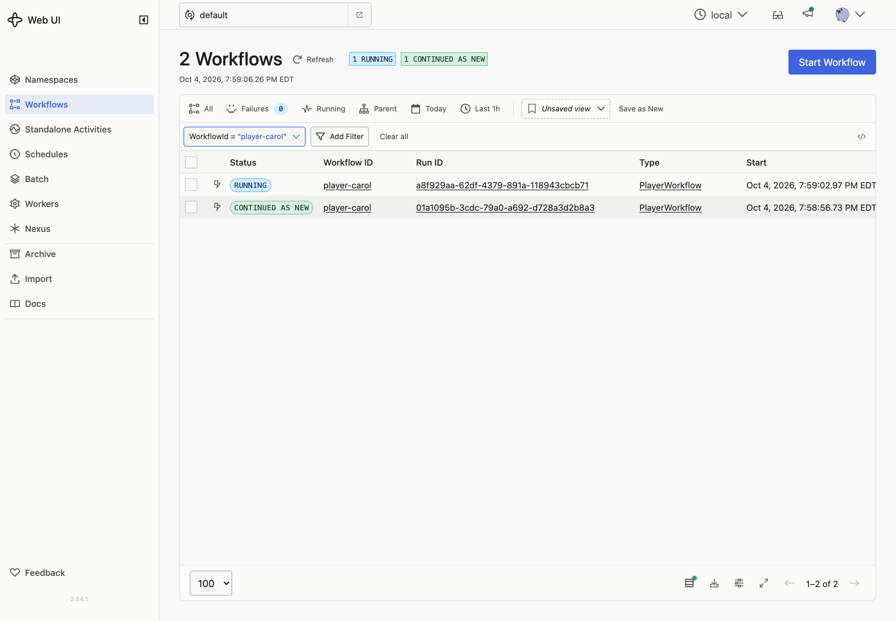
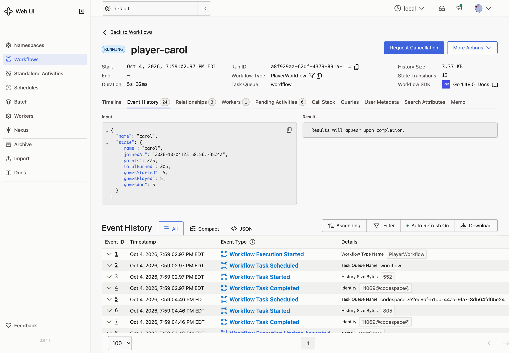

# 10 · Continue-As-New

**Goal:** player and leaderboard Workflows can run forever without their histories growing forever.

## Concepts

**History limits.** Every event is stored, and a Worker that loads a Workflow replays all of them. Long histories are slow to replay, and Temporal caps them: it warns at 10,240 events and terminates the Workflow at 51,200 events or 50 MB. An entity that lives forever will get there.

**Continue-As-New.** Completes the current run and starts a new run with the same Workflow ID, passing whatever state you choose as its input. The new run starts with an empty history. Clients that use the Workflow ID, which ours all do, reach the new run automatically. Each run has its own **Run ID**.

**When to do it.** The Temporal Service tells the Workflow when its history is getting long ("continue-as-new suggested"). Here we also continue at 100 events so you can watch it happen. A Workflow can't read environment variables or files to get a setting like that, so it's a constant in the code.

**Don't lose work in flight.**

- Continue only when idle. A Player with a running child game waits until the game finishes, because the child belongs to this run.
- Wait for running Update handlers to finish first. Otherwise their callers get an error.
- Signals that have arrived but haven't been read are not carried over. The leaderboard reads every buffered Signal before it continues.

## Patterns

- [Continue-As-New](https://docs.temporal.io/design-patterns/continue-as-new)

## What you'll build

- `PlayerInput` and `LeaderboardInput` take an optional state. Each Workflow starts from that state if it's given.
- A shared `shouldContinueAsNew` check: suggested by the server, or at least 100 events.
- The Player waits for "a game started, or time to continue". If it's time and no game is running, it waits for handlers to finish, checks again, and continues as new with its state.
- The leaderboard checks after each Signal, drains buffered Signals, and continues as new with its board.

## Build it

Follow [`build.md`](build.md).

## Check it

Run `make clean-workflows`, restart the Worker and the server, and join as `alice`.

- [ ] Play about five short games. Using two free hints and then letting the clock run out is quick. Watch `player-alice` in the Temporal UI: when her history passes 100 events, the run ends as **Continued as New**.

  

- [ ] The Workflow page now shows the new run. Its input contains her full state: points, games played, and so on.

  

- [ ] The player panel shows the same numbers as before, and new games and hints still work. The API didn't change.
- [ ] To see it sooner, lower the limit to 40 and restart the Worker.
