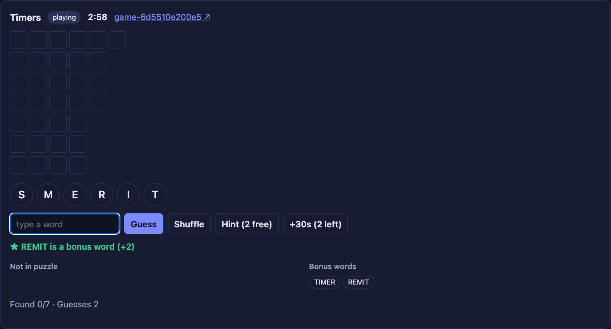
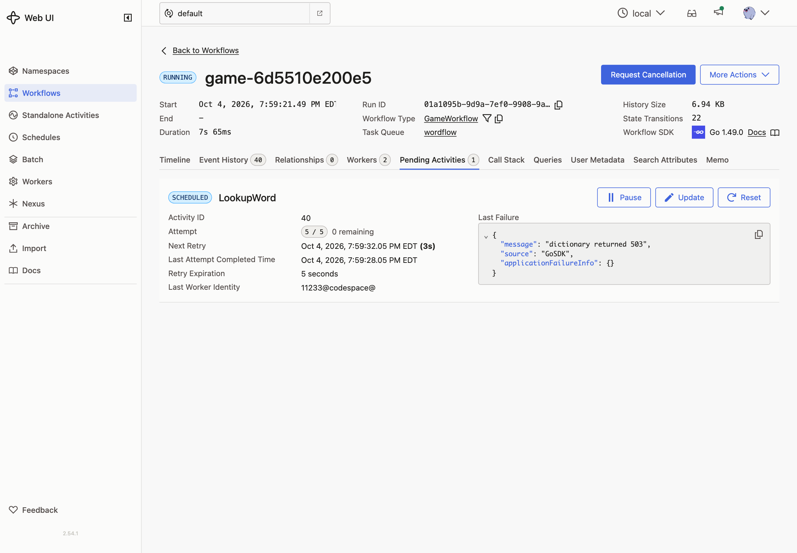

# 11 · Retries in depth

**Goal:** a real word that isn't in the puzzle earns a bonus. Checking it means calling an unreliable dictionary service, and the game must handle every way it fails.

## Concepts

**Retry policy.** Controls how an Activity is retried:

| Field | Meaning | Default |
|---|---|---|
| Initial interval | Wait before the first retry | 1 s |
| Backoff coefficient | Multiplier for each later wait | 2 |
| Maximum interval | Cap on the wait | 100 × initial |
| Maximum attempts | Total attempts; 0 means no limit | 0 |
| Non-retryable error types | Error types that are never retried | none |

**Timeouts.**

| Timeout | Limits |
|---|---|
| Start-To-Close | One attempt. |
| Schedule-To-Close | The whole Activity, including every retry and wait. |
| Heartbeat | Time between heartbeats from a long-running Activity. Used in the Pick First exercise. |

**Not every response is an error.** A `404` from the dictionary means "not a word". That's a valid answer, not a failure.

**Fail gracefully.** If the dictionary can't answer in time, the guess still counts. It's simply not a bonus. The Workflow catches the Activity's final error and moves on.

## Patterns

- [Fixed Count Retries](https://docs.temporal.io/design-patterns/fixed-count-retries): at most 5 attempts.
- [Fixed Wall-Time Retries](https://docs.temporal.io/design-patterns/fixed-wall-time-retries): give up after 10 seconds in total, because a player is waiting.
- [Delayed Retry](https://docs.temporal.io/design-patterns/delayed-retry): when the service says `429 Retry-After: 3`, wait exactly that long.
- [Non-Retryable Errors](https://docs.temporal.io/design-patterns/non-retryable-errors): a `401` won't fix itself.

## What you'll build

- A `LookupWord` Activity that calls `GET /services/dictionary/words/{word}`:
  - `200`: true. `404`: false.
  - `401`: non-retryable error.
  - `429`: retryable error with the next retry delay set from `Retry-After`.
  - Anything else: retryable error.
- The Worker gets the services URL from `SERVICES_URL`, defaulting to `http://localhost:8080/services`.
- An `isRealWord` helper: Start-To-Close 2 s, Schedule-To-Close 10 s, retries starting at 500 ms, doubling, at most 5 attempts. Any final error means false.
- In the `guess` handler: if the outcome is "not in puzzle", the word is real, and the game isn't over, mark it as a bonus.

## Build it

Follow [`build.md`](build.md).

## Check it

Run `make clean-workflows` and restart the Worker. Pick a mode in the **External services** panel, then guess a real word that isn't in the puzzle. Each puzzle file lists some under `extras`. Watch the server log, which prints every dictionary request, and the pending Activity in the Temporal UI.

| Mode | What the service does | What you should see |
|---|---|---|
| `ok` | Answers | **Bonus** right away. |
| `flaky` | 2 of every 3 requests fail with `500` | **Bonus** within about 1.5 s. The log shows up to 3 requests: fail, fail, ok. |
| `slow` | Takes 3 s | Each attempt times out at 2 s. After 10 s the total limit is hit and it's **Not in puzzle**. |
| `rate_limited` | Every other request is `429 Retry-After: 3` | **Bonus**, either right away or after exactly 3 s. Guess a few words to see both. |
| `down` | `503` | 5 attempts over about 7.5 s, then **Not in puzzle**. |
| `unauthorized` | `401` | **Not in puzzle** right away. One request, no retries. |

- [ ] Each row behaves as described.

  

- [ ] While a lookup is retrying, the Temporal UI shows the pending Activity's attempt number and last failure.

  

- [ ] In every mode the game keeps working. The Worker logs a warning when a lookup gives up.

Set the mode back to `ok` when you're done.
