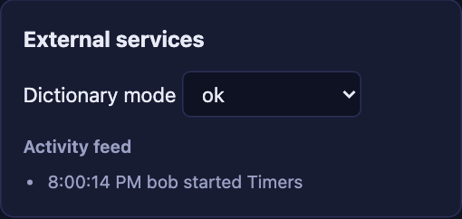
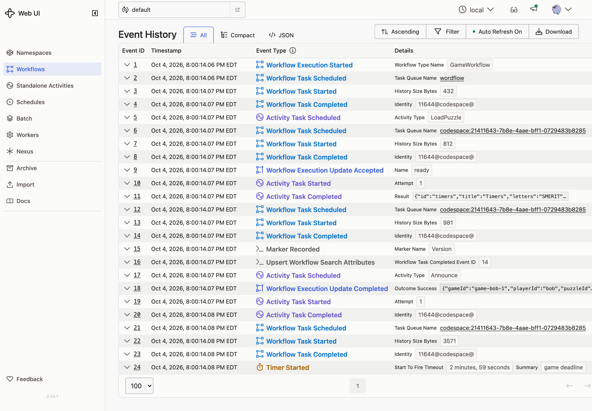

# 13 · Versioning

**Goal:** announce every new game in the feed, without breaking the games that are already running.

## Concepts

**Patching.** Wrap the change in a version check. The first time new code reaches the check, it records a marker in the history and takes the new path. When code replays a history that has no marker, the check returns the default version and the code takes the old path. Old and new Workflows run on the same Worker, each following the code it started with.

**Retiring a patch.** Once no running Workflow can still take the old path, delete the old branch. Keep the check, with the default version as its minimum, until no running Workflow has the old marker either. Then delete the check too.

**Rolling back.** After the new code has run, histories contain the marker. The old code doesn't expect it, so rolling back breaks those Workflows. Replay-test new histories against the old code before you rely on being able to roll back.

**Worker Versioning.** The other approach. Each Worker deployment has a version, and each Workflow is pinned to the version it started on. Old and new Workers run side by side until the old Workflows finish. There are no version checks in the code, but you run more than one Worker deployment at a time. It's the better fit for frequent changes to short Workflows. Patching suits occasional changes to long ones. See [Worker Versioning](https://docs.temporal.io/production-deployment/worker-deployments/worker-versioning).

## What you'll build

- Wrap the `announce` call from Lesson 12 in a version check called `announce-game`. Version 1 announces. The default version doesn't.

## Build it

Follow [`build.md`](build.md).

## Check it

Start with your Lesson 12 code, without the `announce` call, running.

- [ ] Start a game as `alice` and leave it running. Save its history with `make history`.
- [ ] Add the versioned `announce` call. `make replay` prints `ok` for every history, old games included.
- [ ] Restart the Worker. The old game keeps working: guesses, hints, and the clock.
- [ ] Join as `bob` and start a game. The feed shows **bob started ...**. His game's history has a `MarkerRecorded` event, then the `Announce` Activity.

  

  

- [ ] Save Bob's game with `make history`, then run `make replay S=12`. Bob's game fails on the Lesson 12 code. That's why you can't simply roll back.
