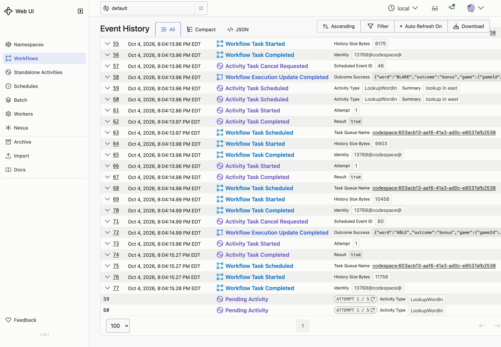

# Extra · Pick First

**Goal:** the dictionary has two regions, and each is slow at random. Ask both, use whichever answers first, and cancel the other.

## Concepts

**Run in parallel, take the first.** Start several Activities without waiting, then wait for whichever finishes first.

**Cancel the rest.** Cancel the scope the other Activities were started in. The Workflow records the cancel request and moves on.

**Activities learn about cancellation from heartbeats.** A running Activity is just your code on a Worker. It only finds out it was cancelled when it sends a heartbeat and the reply says so. Then its context is cancelled, which also aborts its HTTP request. Activities that should stop early must heartbeat and have a heartbeat timeout.

**This changes running games.** The `guess` handler now produces different commands. Wrap the change in a version check, as in Lesson 13.

## Patterns

- [Pick First](https://docs.temporal.io/design-patterns/pick-first)

## What you'll build

- The dictionary service takes `?region=NAME` and adds 0–1.5 s of random latency.
- A `LookupWordIn` Activity that sends the region and heartbeats while it waits.
- `isRealWordFastest`: start a lookup in `east` and `west`, wait for the first, cancel the other.
- A `race-dictionary` version check that chooses between the old single lookup and the race.

## Build it

Follow [`build.md`](build.md).

## Check it

- [ ] Start a new game and guess a few bonus words. They're still marked as bonuses.
- [ ] The server log shows both regions for each word: one answers, and the other logs **caller gave up** a moment later.
- [ ] The game's history shows two `ActivityTaskScheduled` events labelled **lookup in east** and **lookup in west**, one completed, and `ActivityTaskCancelRequested` for the other.

  

- [ ] A game that started before the change still makes one lookup per word.
