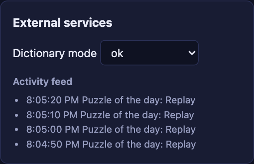
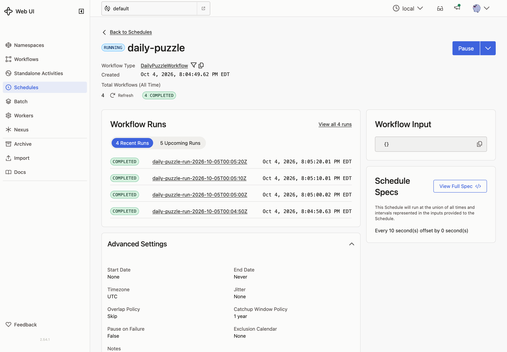

# Extra · Schedules

**Goal:** a puzzle of the day, announced in the feed on a schedule.

## Concepts

**Schedule.** A Temporal Service object that starts a Workflow on a timetable, either an interval or calendar times. You can pause it, trigger it now, backfill missed runs, and choose what happens when a run is still going when the next one is due (the overlap policy). It lives in the Temporal Service, so nothing of yours has to be running to keep time.

**Each run is a normal Workflow.** Its ID is the Schedule's Workflow ID plus the scheduled time, for example `daily-puzzle-run-2026-10-04T12:00:00Z`.

**Delayed Start.** For a single run later, start the Workflow with a start delay. It exists right away and runs when the delay ends.

## Patterns

- [Delayed Start](https://docs.temporal.io/design-patterns/delayed-start)
- [Schedules](https://docs.temporal.io/schedule)

## What you'll build

- `DailyPuzzleWorkflow`: a `PickPuzzle` Activity chooses a puzzle based on the day, then the Workflow announces it.
- A command that creates the `daily-puzzle` Schedule, deletes it, or starts a single delayed run.

## Build it

Follow [`build.md`](build.md).

## Check it

- [ ] Create the Schedule with a 10-second interval. Every 10 seconds the feed shows **Puzzle of the day: ...**.

  

- [ ] The Temporal UI's **Schedules** page lists `daily-puzzle` with its recent runs. Pause it there, and the announcements stop. Unpause it, and they resume.

  

- [ ] Delete the Schedule.
- [ ] Start a single run with a 30-second delay. It appears in the Workflow list right away, but nothing happens until 30 seconds later, when the announcement appears.
